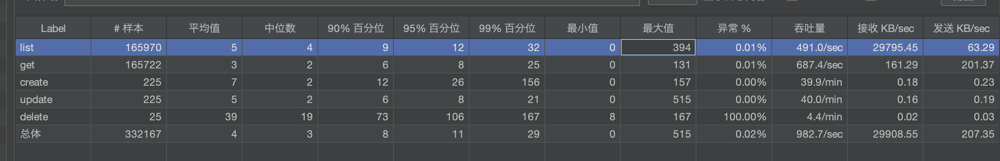
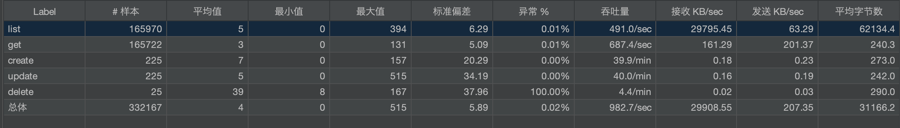

# 银行交易管理系统

## 项目概述
这是一个基于Java 21和Spring Boot构建的银行交易管理系统。系统提供了交易记录的创建、查询、修改和删除等核心功能，所有数据存储在内存中。

## 技术栈
- Java 21
- Spring Boot 3.x
- Maven
- Docker
- Kubernetes

## 主要功能
- 创建交易
- 删除交易
- 修改交易
- 查询所有交易
- 分页查询
- 缓存支持
- 完善的异常处理


## API文档

### 交易管理API

#### 创建交易
`POST /api/transactions`

请求体：
```json
{
  "id": "交易ID",
  "amount": 100.0,
  "type": "DEPOSIT|WITHDRAWAL",
  "description": "交易描述"
}
```

#### 获取所有交易
`GET /api/transactions`

#### 获取单个交易
`GET /api/transactions/{id}`

#### 更新交易
`PUT /api/transactions/{id}`

#### 删除交易
`DELETE /api/transactions/{id}`

## 构建和运行

### 本地运行
```bash
mvn spring-boot:run
```

### 构建
```bash
mvn clean package
```

### 测试
```bash
mvn test
```

## 容器化部署

### 构建Docker镜像
```bash
docker-compose build
```

### 启动服务
```bash
docker-compose up
```

### Kubernetes部署
```bash
kubectl apply -f k8s-deployment.yaml
```

## 性能优化
- 使用内存缓存提高查询性能
- 实现分页查询避免大数据量传输
- 使用线程池处理并发请求
- 压力测试保证系统稳定性

## 测试策略
- 单元测试覆盖核心业务逻辑
- 集成测试验证API功能
- 压力测试验证系统性能
- 边界测试验证异常处理

## 性能测试

### 性能需求
- 事务成功率：100%
- CPU使用率：≤70%
- 内存使用率：≤70%
- 平均响应时间：≤500ms
- 最大响应时间：≤2s

### 测试工具
- JMeter 5.6.3

### 测试场景
1. 20个线程连续执行：
   - 创建交易
   - 更新交易
   - 删除交易
2. 20个线程连续执行：
   - 查询所有交易


### 压力测试
- 硬件配置：
  - CPU：xx核
  - 内存：24GB
- JMeter配置：
  - 线程数：20
  - 循环次数：1000
  - 超时时间：5s

### 性能结果




## 依赖库
- Spring Boot Starter Web
- Spring Boot Starter Test
- Spring Boot Starter Cache
- Spring Boot Starter Validation
- JUnit 5
- Mockito
