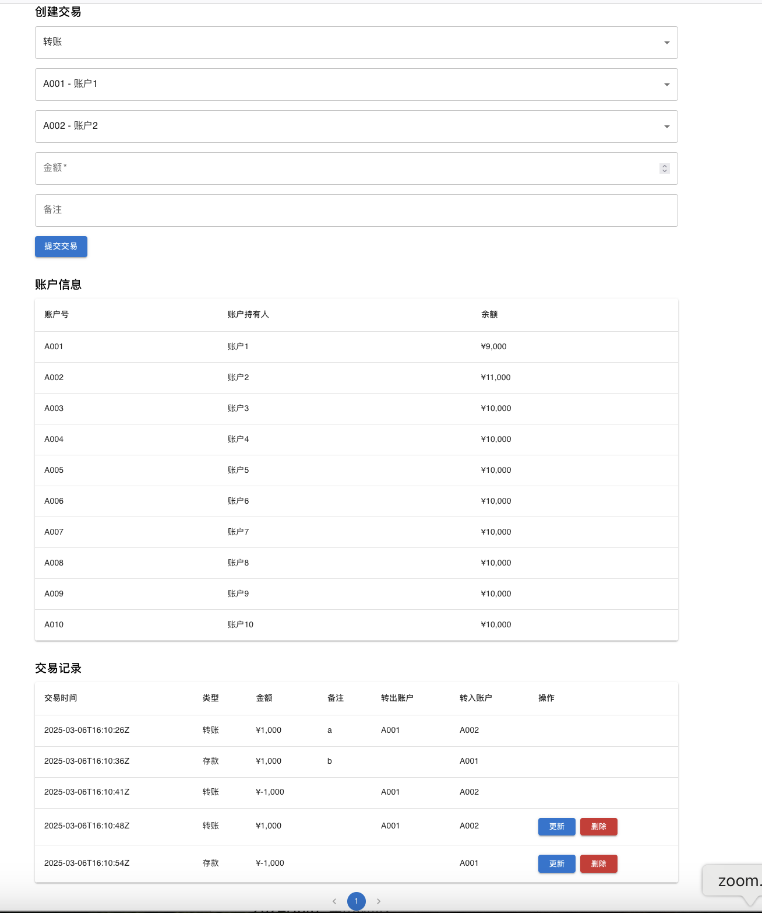

# 银行交易管理系统

一个使用Java 21和Spring Boot构建的现代化银行交易管理应用。该系统提供了一个强大的API用于管理金融交易，重点关注性能、可靠性和可扩展性。

## 主要功能

- **交易管理**：创建、读取、更新和删除交易
- **实时处理**：内存交易处理以实现高性能
- **RESTful API**：干净且文档完善的API端点
- **全面测试**：单元测试、集成测试和压力测试
- **容器化**：支持Docker
- **缓存**：高效的缓存机制以提高性能（待实现）
- **验证**：强大的输入验证和错误处理
- **分页**：支持分页的高效数据检索

## 技术栈

- **后端**：Java 21, Spring Boot 3.x
- **前端**：React.js with Material-UI
- **数据库**：内存存储（无持久化）
- **构建工具**：Maven
- **容器化**：Docker
- **测试**：JUnit 5,  JMeter

## API文档

### 交易API

#### 创建交易
`POST /api/transactions`

**请求体:**
```json
{
  "type": "TRANSFER|DEPOSIT|WITHDRAWAL",
  "amount": 100.0,
  "description": "string",
  "fromAccountNumber": "string", // TRANSFER和WITHDRAWAL必填
  "toAccountNumber": "string" // TRANSFER和DEPOSIT必填
}
```

#### 获取所有交易
`GET /api/transactions?page=0&size=10`

#### 按ID获取交易
`GET /api/transactions/{id}`

#### 更新交易
`PUT /api/transactions/{id}`

#### 删除交易
`DELETE /api/transactions/{id}`

## 安装说明

1. **先决条件**:
   - Java 21 JDK
   - Maven 3.8+
   - Node.js 18+ (用于前端)
   - Docker (可选)


## 运行应用

### 本地模式
```bash
# 启动后端
mvn spring-boot:run

# 启动前端
cd frontend
npm start
```

### 开发模式（使用Docker）
```bash
docker-compose up --build
```

## 测试

### 单元测试（暂时只显示一部分）
```bash
mvn test
```

### 集成测试
```bash
mvn verify
```

### 压力测试（只测试了v1，没有账号情况下）
```bash
# 使用JMeter
jmeter -n -t src/test/jmeter/TransactionLoadTest.jmx
```

## 容器化

应用完全使用Docker容器化：

- **后端**：Java 21 with Spring Boot
- **前端**：Nginx with React build
- **数据库**：内存存储（无需外部数据库，初始创建10个账号）


## 缓存实现 (待实现)

系统使用Spring Cache with Caffeine用于：

- 频繁访问的交易数据
- 账户信息
- API响应缓存

缓存配置可在`application.properties`中调整：
```properties
spring.cache.caffeine.spec=maximumSize=500,expireAfterAccess=10m
```

## 性能考虑

- 内存存储以实现快速数据访问

## 错误处理

系统提供全面的错误处理，包括：

- 自定义错误响应
- HTTP状态码
- 详细的错误信息
- 验证约束
- 全局异常处理

错误响应示例：
```json
{
  "timestamp": "2025-03-06T14:52:47.123+08:00",
  "status": 400,
  "error": "Bad Request",
  "message": "无效的交易金额",
  "path": "/api/transactions"
}
```

## 分页

API支持以下分页参数：

- `page`: 页码（从0开始）
- `size`: 每页项目数

响应示例：
```json
{
  "content": [
    // 交易对象
  ],
  "pageable": {
    "pageNumber": 0,
    "pageSize": 10,
    "sort": {
      "sorted": false,
      "unsorted": true,
      "empty": true
    },
    "offset": 0,
    "paged": true,
    "unpaged": false
  },
  "last": false,
  "totalPages": 5,
  "totalElements": 50,
  // ... 其他分页元数据
}
```

## 许可证

xxxxx


